# WPROWADZENIE

Wykorzystywany zbiór danych pochodzi z serwisu [Kaggle.com](https://www.kaggle.com/datasets/krzysztofjamroz/apartment-prices-in-poland/data "Apartment Prices in Poland") i zawiera ceny mieszkań z 15 największych miast w Polsce. Rzeczone dane były zbierane co miesiąc, od sierpnia 2023 do czerwca 2024.

Po pobraniu paczki spakowanych danych wyłaniają się przed nami pliki o następującej strukturze:
* apartments_pl_YYYY_MM.csv
* apartments_rent_pl_YYYY_MM.csv

Na potrzeby naszej analizy będziemy korzystać tylko ze zbioru **apartments_pl_YYYY_MM.csv**, gdyż będziemy analizować mieszkania wystawione na sprzedaż, a nie na wynajem.

W datasecie znajduje się 195568 obserwacji.

Dane pochodzą z ogłoszeń, a nie z aktów notarialnych, w związku z czym mogą zawierać ceny ofertowe, a nie transakcyjne. Ponadto oferty pochodzą z kolejnych miesięcy, więc część z nich może się powtarzać.

Cały kod jest częścią naszego projektu końcowego z ML, w którym staramy przewiedzieć ceny mieszkań na podstawie szeregu parametrów, takich jak miasto, metraż, liczba pokoi, piętro, liczba pięter w budynku, rok budowy, odległość od centrum miasta, odległość od poszczególnych POI, oraz udogodnień, takich jak winda, garaż, miejsce parkingowe, ochrona, balkon i komórka lokatorska.

Ponadto chcielibyśmy znaleźć odpowiedzi na następujących pytania:
1. Jak rozkładają się ceny mieszkań w poszczególnych miastach.
2. Jakie parametry mieszkań i ich udogodnienia wpływają na cenę.


```python
# 0. Importowanie bibliotek
import pandas as pd
import numpy as np
import matplotlib.pyplot as plt
import matplotlib.ticker as ticker
import seaborn as sns
from pathlib import Path
import sys
import missingno as msno
import jinja2 as j2
from sklearn.impute import KNNImputer    

```


```python
# Konfiguracja stylu wykresów
plt.style.use('seaborn-v0_8-whitegrid')
sns.set_palette('Set2')
FIGSIZE = (12, 8)
plt.rcParams['figure.figsize'] = FIGSIZE
formatter = ticker.FuncFormatter(lambda x, pos: f'{x/1000:.0f}k')
```

Wczytujemy i łączymy wszystkie pliki CSV odnoszące się do sprzedaży mieszkań.


```python
# Filtrowanie argumentów Jupytera
sys.argv = [arg for arg in sys.argv if not arg.startswith('--f=')]

# 1. Wczytywanie danych
# Ustawienie katalogu z danymi
# Można podać katalog jako argument wiersza poleceń lub użyć domyślnego katalogu 'data'
# Jeśli katalog nie istnieje, zostanie zgłoszony błąd FileNotFoundError
if len(sys.argv) > 1:
    DATA_DIR = Path(sys.argv[1])
else:
    DATA_DIR = Path.cwd() / 'data'
    
# Sprawdzenie czy katalog istnieje
if not DATA_DIR.exists():
    raise FileNotFoundError(f"Directory does not exist: {DATA_DIR}")
print(f"Looking for CSV files in: {DATA_DIR.resolve()}")
csv_files = [f for f in DATA_DIR.glob('apartments_pl_*.csv') if f.is_file() and f.suffix.lower() == '.csv']

# Sprawdzenie czy znaleziono pliki CSV
print(f"Found {len(csv_files)} CSV files:")
for f in csv_files:
    print(" -", f.name)
if len(csv_files) == 0:
    raise FileNotFoundError(f"No CSV files found in '{DATA_DIR.resolve()}'.")

# Wczytywanie plików CSV do DataFrame
df_list = []
for file in csv_files:
    try:
        df_list.append(pd.read_csv(file))
    except Exception as e:
        print(f"Error loading {file.name}: {str(e)}")
if not df_list:
    raise RuntimeError("No valid CSV files loaded")

# Łączenie wszystkich DataFrame w jeden
df = pd.concat(df_list, ignore_index=True, sort=False)
print(f"Combined dataframe shape: {df.shape}")
```

    Looking for CSV files in: C:\Users\olale\Desktop\PG\ML\ML_Project\data
    Found 11 CSV files:
     - apartments_pl_2023_08.csv
     - apartments_pl_2023_09.csv
     - apartments_pl_2023_10.csv
     - apartments_pl_2023_11.csv
     - apartments_pl_2023_12.csv
     - apartments_pl_2024_01.csv
     - apartments_pl_2024_02.csv
     - apartments_pl_2024_03.csv
     - apartments_pl_2024_04.csv
     - apartments_pl_2024_05.csv
     - apartments_pl_2024_06.csv
    Combined dataframe shape: (195568, 28)
    

## Czyszczenie i porządkowanie danych
Zaczynamy od podstawowych działąń na datasecie, typu sprawdzenie danych, kolumn, statystyk opisowych, unikalnych wartości i zduplikowanych obserwacji.


```python
# Diagnostyka danych
print("\n--- Podstawowe informacje o danych ---")
print(df.head())
print("\n--- Informacje o kolumnach ---")
print(df.info())
print("\n--- Statystyki ---")
print(df.describe())
print("\n--- Unikalne wartości ---")
print(df.nunique().sort_values(ascending=False))

# Identyfikacja powtarzających się wartości i ich usunięcie
print("\n--- Identyfikacja powtarzających się wartości ---")
duplicates = df.duplicated(subset='id').sum()
print(f"Liczba zduplikowanych wierszy: {duplicates}")
if duplicates > 0:
    print("Usuwanie zduplikowanych wierszy...")
    df = df.drop_duplicates(subset='id')
    df.duplicated(subset='id').sum()
    print(f"Dane po usunięciu duplikatów: {df.shape}")


# Analiza braków danych
print("\n--- Analiza brakujących danych ---")
missing_percent = df.isnull().mean().sort_values(ascending=False) * 100
missing_percent = missing_percent[missing_percent > 0]
missing_df = pd.DataFrame({
    'Liczba braków': df.isnull().sum()[missing_percent.index],
    'Rozkład procentowy braków': missing_percent.round(2)
})
print(missing_df)

# Wizualizacja braków danych za pomocą biblioteki missingno
plt.figure(figsize=(12, 6))
msno.matrix(df)
plt.title('Missing Data Matrix')
plt.tight_layout()
plt.show()

# Wizualizacja braków danych
missing_percent_sorted = (
    missing_percent[missing_percent > 0]
    .sort_values(ascending=False)
)

fig, ax = plt.subplots(figsize=(12, 6))

bars = ax.barh(
    missing_percent_sorted.index,
    missing_percent_sorted.values,
    color='steelblue'
)

ax.set_title('Procent braków danych w kolumnach', fontsize=14)
ax.set_xlabel('Procent braków (%)')
ax.set_ylabel('Kolumny')
ax.invert_yaxis()                                     
ax.set_xlim(0, missing_percent_sorted.max() * 1.15)

ax.bar_label(
    bars,
    labels=[f'{v:.1f}%' for v in missing_percent_sorted.values],
    padding=3,
    label_type='edge',
    fontsize=9)

plt.tight_layout()
plt.show()

```

    
    --- Podstawowe informacje o danych ---
                                     id      city          type  squareMeters  \
    0  f8524536d4b09a0c8ccc0197ec9d7bde  szczecin  blockOfFlats         63.00   
    1  accbe77d4b360fea9735f138a50608dd  szczecin  blockOfFlats         36.00   
    2  8373aa373dbc3fe7ca3b7434166b8766  szczecin      tenement         73.02   
    3  0a68cd14c44ec5140143ece75d739535  szczecin      tenement         87.60   
    4  f66320e153c2441edc0fe293b54c8aeb  szczecin  blockOfFlats         66.00   
    
       rooms  floor  floorCount  buildYear   latitude  longitude  ...  \
    0    3.0    4.0        10.0     1980.0  53.378933  14.625296  ...   
    1    2.0    8.0        10.0        NaN  53.442692  14.559690  ...   
    2    3.0    2.0         3.0        NaN  53.452222  14.553333  ...   
    3    3.0    2.0         3.0        NaN  53.435100  14.532900  ...   
    4    3.0    1.0         3.0        NaN  53.410278  14.503611  ...   
    
       pharmacyDistance    ownership  buildingMaterial  condition  \
    0             0.413  condominium      concreteSlab        NaN   
    1             0.205  cooperative      concreteSlab        NaN   
    2             0.280  condominium             brick        NaN   
    3             0.087  condominium             brick        NaN   
    4             0.514  condominium               NaN        NaN   
    
       hasParkingSpace  hasBalcony  hasElevator  hasSecurity  hasStorageRoom  \
    0              yes         yes          yes           no             yes   
    1               no         yes          yes           no             yes   
    2               no          no           no           no              no   
    3              yes         yes           no           no             yes   
    4               no          no           no           no              no   
    
        price  
    0  415000  
    1  395995  
    2  565000  
    3  640000  
    4  759000  
    
    [5 rows x 28 columns]
    
    --- Informacje o kolumnach ---
    <class 'pandas.core.frame.DataFrame'>
    RangeIndex: 195568 entries, 0 to 195567
    Data columns (total 28 columns):
     #   Column                Non-Null Count   Dtype  
    ---  ------                --------------   -----  
     0   id                    195568 non-null  object 
     1   city                  195568 non-null  object 
     2   type                  153307 non-null  object 
     3   squareMeters          195568 non-null  float64
     4   rooms                 195568 non-null  float64
     5   floor                 160974 non-null  float64
     6   floorCount            193185 non-null  float64
     7   buildYear             163352 non-null  float64
     8   latitude              195568 non-null  float64
     9   longitude             195568 non-null  float64
     10  centreDistance        195568 non-null  float64
     11  poiCount              195568 non-null  float64
     12  schoolDistance        195400 non-null  float64
     13  clinicDistance        194840 non-null  float64
     14  postOfficeDistance    195320 non-null  float64
     15  kindergartenDistance  195361 non-null  float64
     16  restaurantDistance    195089 non-null  float64
     17  collegeDistance       190132 non-null  float64
     18  pharmacyDistance      195291 non-null  float64
     19  ownership             195568 non-null  object 
     20  buildingMaterial      118186 non-null  object 
     21  condition             49261 non-null   object 
     22  hasParkingSpace       195568 non-null  object 
     23  hasBalcony            195568 non-null  object 
     24  hasElevator           185866 non-null  object 
     25  hasSecurity           195568 non-null  object 
     26  hasStorageRoom        195568 non-null  object 
     27  price                 195568 non-null  int64  
    dtypes: float64(16), int64(1), object(11)
    memory usage: 41.8+ MB
    None
    
    --- Statystyki ---
            squareMeters          rooms          floor     floorCount  \
    count  195568.000000  195568.000000  160974.000000  193185.000000   
    mean       58.697667       2.679222       3.332414       5.309113   
    std        21.407206       0.915024       2.531684       3.312234   
    min        25.000000       1.000000       1.000000       1.000000   
    25%        44.000000       2.000000       2.000000       3.000000   
    50%        54.600000       3.000000       3.000000       4.000000   
    75%        68.550000       3.000000       4.000000       6.000000   
    max       150.000000       6.000000      29.000000      29.000000   
    
               buildYear       latitude      longitude  centreDistance  \
    count  163352.000000  195568.000000  195568.000000   195568.000000   
    mean     1985.976346      52.026288      19.465989        4.351114   
    std        33.812810       1.335275       1.783264        2.835764   
    min      1850.000000      49.978999      14.447100        0.010000   
    25%      1967.000000      51.108796      18.523270        2.010000   
    50%      1994.000000      52.194596      19.899434        3.980000   
    75%      2016.000000      52.409006      20.989907        6.150000   
    max      2024.000000      54.606460      23.208873       16.940000   
    
                poiCount  schoolDistance  clinicDistance  postOfficeDistance  \
    count  195568.000000   195400.000000   194840.000000       195320.000000   
    mean       20.672037        0.412651        0.970287            0.516340   
    std        24.325708        0.464193        0.888884            0.498013   
    min         0.000000        0.002000        0.001000            0.001000   
    25%         7.000000        0.176000        0.356000            0.239000   
    50%        14.000000        0.290000        0.676000            0.393000   
    75%        24.000000        0.468000        1.237000            0.623000   
    max       212.000000        4.946000        4.999000            4.970000   
    
           kindergartenDistance  restaurantDistance  collegeDistance  \
    count         195361.000000       195089.000000     190132.00000   
    mean               0.367560            0.345257          1.44327   
    std                0.444673            0.463510          1.10457   
    min                0.001000            0.001000          0.00400   
    25%                0.156000            0.114000          0.57700   
    50%                0.262000            0.229000          1.12000   
    75%                0.416000            0.409000          2.05500   
    max                4.961000            4.985000          5.00000   
    
           pharmacyDistance         price  
    count     195291.000000  1.955680e+05  
    mean           0.358114  7.841833e+05  
    std            0.457679  4.097092e+05  
    min            0.001000  1.500000e+05  
    25%            0.142000  5.200000e+05  
    50%            0.239000  6.990000e+05  
    75%            0.406000  9.300000e+05  
    max            4.992000  3.250000e+06  
    
    --- Unikalne wartości ---
    id                      92967
    longitude               49315
    latitude                47484
    price                    8092
    squareMeters             7201
    collegeDistance          4825
    clinicDistance           4282
    postOfficeDistance       2713
    schoolDistance           2537
    pharmacyDistance         2446
    restaurantDistance       2437
    kindergartenDistance     2342
    centreDistance           1489
    poiCount                  196
    buildYear                 166
    floorCount                 29
    floor                      27
    city                       15
    rooms                       6
    type                        3
    ownership                   3
    buildingMaterial            2
    condition                   2
    hasParkingSpace             2
    hasBalcony                  2
    hasElevator                 2
    hasSecurity                 2
    hasStorageRoom              2
    dtype: int64
    
    --- Identyfikacja powtarzających się wartości ---
    Liczba zduplikowanych wierszy: 102601
    Usuwanie zduplikowanych wierszy...
    Dane po usunięciu duplikatów: (92967, 28)
    
    --- Analiza brakujących danych ---
                          Liczba braków  Rozkład procentowy braków
    condition                     69914                      75.20
    buildingMaterial              39179                      42.14
    type                          19792                      21.29
    floor                         15984                      17.19
    buildYear                     15641                      16.82
    hasElevator                    4448                       4.78
    collegeDistance                2492                       2.68
    floorCount                     1082                       1.16
    clinicDistance                  333                       0.36
    restaurantDistance              226                       0.24
    pharmacyDistance                128                       0.14
    postOfficeDistance               99                       0.11
    kindergartenDistance             85                       0.09
    schoolDistance                   60                       0.06
    

    C:\Users\olale\AppData\Local\Temp\ipykernel_12048\731635470.py:36: UserWarning: This figure includes Axes that are not compatible with tight_layout, so results might be incorrect.
      plt.tight_layout()
    


    <Figure size 1200x600 with 0 Axes>


    
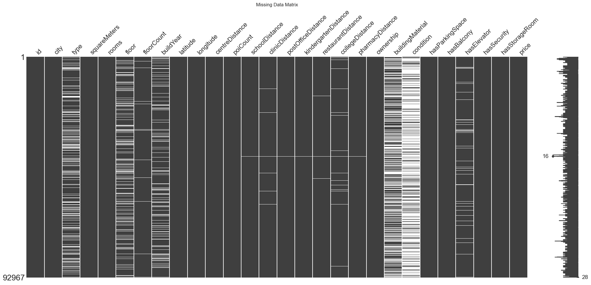
    


    
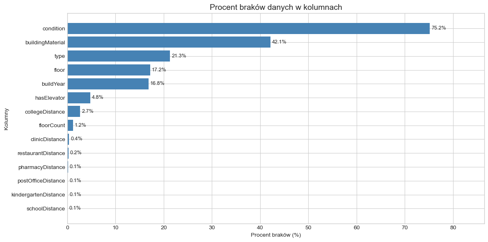
    


Połączony zbiór danych zawiera ok. 196 tys. wierszy, a po usunięciu duplikatów zostaje niecałe 93 tys. wierszy (spadek o 52%). Jest to działanie zamierzone, gdyż interesuje nas analiza danych dotyczących mieszkań, a nie samych ogłoszeń, więc potrzebujemy tylko jednej obserwacji na mieszkanie.

Jak widać na powyższych wizualizacjach, brakuje sporo danych, zwłaszcza w kolumnach 'condition' (prawie 75%) oraz 'buildingMaterial' (ponad 42%). Rozważamy ich usunięcie, a w przypadku kolumn z mniejszą liczbą braków - wypełnienie metodą KNN-imputacji osobno dla każdego miasta (KNNImputer, k=5), co pozwoli zachować większą liczbę pełnych obserwacji niż przy prostym uzupełnianiu medianą dla całej populacji.


```python
# Strategia imputacji i obsługa braków
# Usunięcie kolumn z >75% braków
cols_to_drop = ['condition']
df = df.drop(columns=cols_to_drop, errors='ignore')

# 1. KNNImputer do braków liczbowych
def knn_impute_by_city(df, numeric_cols):
    frames = []
    for city, group in df.groupby('city'):
        imputer = KNNImputer(n_neighbors=5)
        group_num = group[numeric_cols].copy()
        imputed = imputer.fit_transform(group_num)
        group.loc[:, numeric_cols] = imputed
        frames.append(group)
    return pd.concat(frames)

numeric_cols = [
    'floor', 'floorCount', 'buildYear',
    'schoolDistance', 'clinicDistance', 'postOfficeDistance',
    'kindergartenDistance', 'restaurantDistance', 'collegeDistance',
    'pharmacyDistance'
]

# Zamiana kolumn na liczby
for col in numeric_cols:
    if col in df.columns:
        df[col] = pd.to_numeric(df[col], errors='coerce')

print("Imputacja braków za pomocą KNNImputer")
df = knn_impute_by_city(df, numeric_cols)

# 2. Imputacja modą dla zmiennych kategorycznych
cat_cols = ['type', 'buildingMaterial', 'hasElevator']
for col in cat_cols:
    if col in df.columns:
        mode_val = df[col].mode(dropna=True)[0]      # dominująca wartość
        df[col] = df[col].fillna(mode_val)           # brak chained‑assignment

# 3. Usunięcie pozostałych braków
before_drop = len(df)
df = df.dropna()
after_drop  = len(df)
print(f"Usunięto {before_drop - after_drop} wierszy "
      f"({(before_drop - after_drop) / before_drop:.2%})")
```

    Imputuję braki za pomocą KNNImputer
    Usunięto 0 wierszy (0.00%)
    


```python
# Sprawdzenie, czy zostały jakieś braki
missing_after = df.isnull().sum().sum()
if missing_after > 0:
    print(f"Uwaga: W datasecie wciąż brakuje {missing_after} wartości.")
# Wizualizacja braków danych za pomocą biblioteki missingno po imputacji
plt.figure(figsize=(12, 6))
msno.matrix(df)
plt.title('Wykres braków danych po imputacji')
plt.tight_layout()
plt.show()
```

    C:\Users\olale\AppData\Local\Temp\ipykernel_12048\2023313051.py:9: UserWarning: This figure includes Axes that are not compatible with tight_layout, so results might be incorrect.
      plt.tight_layout()
    


    <Figure size 1200x600 with 0 Axes>


    
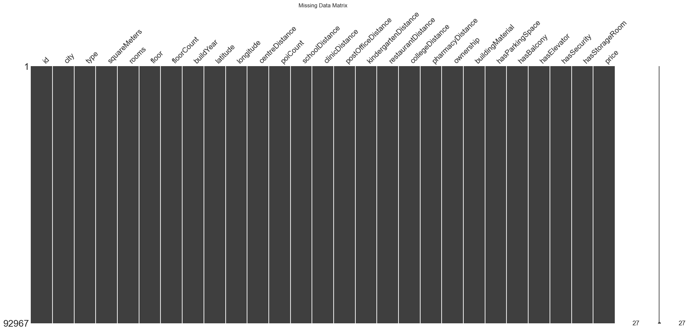
    


Ceny mieszkań wykazują dużą zmienność i często posiadają wartości odstające (tzw. outliery), które mogą zaburzać wyniki analiz. W celu lepszego zrozumienia rozkładu cen, wykonaliśmy histogram oraz wykres typu boxplot przedstawiający pełen zakres zmienności.


```python
# Obserwacje odstające

# Histogram cen mieszkań
fig, ax = plt.subplots(1, 1, figsize=(12, 6))
fmt = ticker.FuncFormatter(lambda x, pos: f'{x/1000:.0f} tys.')
sns.histplot(df['price'], bins=50, kde=True, ax=ax, color='skyblue')
ax.set_title('Histogram cen mieszkań')
ax.set_xlabel('Cena (PLN)')
ax.set_ylabel('Liczba mieszkań')
ax.grid(True, linestyle='--', alpha=0.5)
ax.xaxis.set_major_formatter(fmt)
plt.show()

# Boxplot ceny mieszkań
fig, ax = plt.subplots(1, 1, figsize=(12, 6))
fmt = ticker.FuncFormatter(lambda x, pos: f'{x/1000:.0f} tys.')
sns.boxplot(x=df['price'], ax=ax, color='skyblue')
ax.set_title('Rozkład cen mieszkań')
ax.set_xlabel('Cena (PLN)')
ax.xaxis.set_major_formatter(fmt)
plt.show()

```


    

    


    
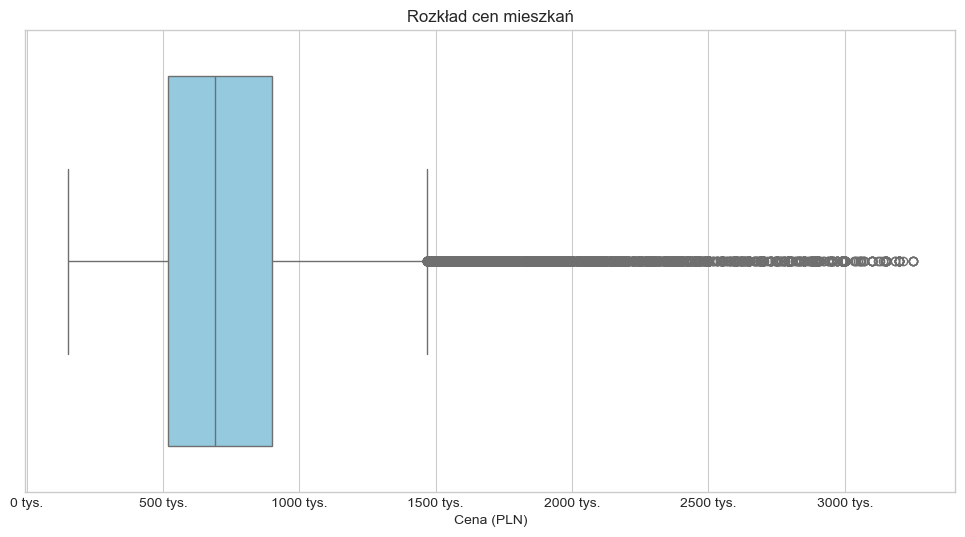
    


Na boxplocie możemy dostrzec długi ogon prawostronny. Ze względu na obecność wartości skrajnie wysokich lub niskich, ograniczono dane do zakresu między 1. a 95. percentylem rozkładu cen. Takie podejście pozwala zachować 94% głównych obserwacji, eliminując przypadki odstające, które mogłyby zniekształcić wnioski statystyczne i wizualizacje.

Dla poprawy symetrii rozkładu danych i ewentualnych analiz statystycznych można rozważyć transformację zmiennej 'price', np. poprzez zastosowanie logarytmu.


```python
# Sprawdzenie liczby obserwacji przed filtrowaniem
print(f"Liczba obserwacji: {df.shape}")

# Ustawienia percentyli
lower_p = 0.01
upper_p = 0.95

# Przefiltrowanie outlierów osobno dla każdego miasta
filtered_df_list = []

for city, group in df.groupby('city'):
    p_low = group['price'].quantile(lower_p)
    p_high = group['price'].quantile(upper_p)
    filtered = group[(group['price'] >= p_low) & (group['price'] <= p_high)]
    filtered_df_list.append(filtered)
    print(f"{city}: {group.shape[0]} → {filtered.shape[0]} (usunięto {group.shape[0] - filtered.shape[0]})")

# Połączenie danych po odfiltrowaniu
df = pd.concat(filtered_df_list)
print(f"Liczba obserwacji po usunięciu wartości odstających: {df.shape}")
```

    Liczba obserwacji: (92967, 27)
    bialystok: 1017 → 955 (usunięto 62)
    bydgoszcz: 3627 → 3414 (usunięto 213)
    czestochowa: 1242 → 1171 (usunięto 71)
    gdansk: 8244 → 7749 (usunięto 495)
    gdynia: 3569 → 3354 (usunięto 215)
    katowice: 2397 → 2258 (usunięto 139)
    krakow: 14186 → 13337 (usunięto 849)
    lodz: 7073 → 6657 (usunięto 416)
    lublin: 2299 → 2162 (usunięto 137)
    poznan: 3639 → 3431 (usunięto 208)
    radom: 845 → 794 (usunięto 51)
    rzeszow: 762 → 715 (usunięto 47)
    szczecin: 2487 → 2340 (usunięto 147)
    warszawa: 31982 → 30076 (usunięto 1906)
    wroclaw: 9598 → 9030 (usunięto 568)
    Liczba obserwacji po usunięciu wartości odstających: (87443, 27)
    


```python

# Histogram cen po oczyszczeniu
fig, ax = plt.subplots(1, 1, figsize=(12, 6))
fmt = ticker.FuncFormatter(lambda x, pos: f'{x/1000:.0f} tys.')
sns.histplot(df['price'], bins=50, kde=True, ax=ax, color='skyblue')
ax.set_title('Histogram cen mieszkań po usunięciu wartości odstających – osobno dla każdego miasta')
ax.set_xlabel('Cena (PLN)')
ax.set_ylabel('Liczba mieszkań')
ax.xaxis.set_major_formatter(fmt)
ax.set_xlim(left=0)
ax.grid(True, linestyle='--', alpha=0.5)
plt.tight_layout()
plt.show()

# Boxplot po oczyszczeniu
fig, ax = plt.subplots(1, 1, figsize=(12, 6))
sns.boxplot(x=df['price'], ax=ax, color='skyblue')
ax.set_title('Rozkład cen mieszkań po usunięciu wartości odstających')
ax.set_xlabel('Cena (PLN)')
ax.xaxis.set_major_formatter(fmt)
plt.tight_layout()
plt.show()

```


    
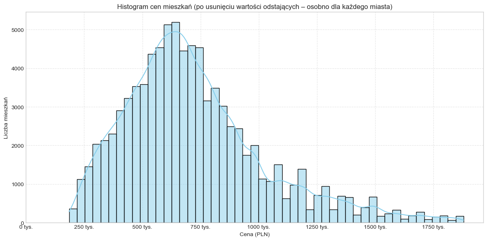
    


    
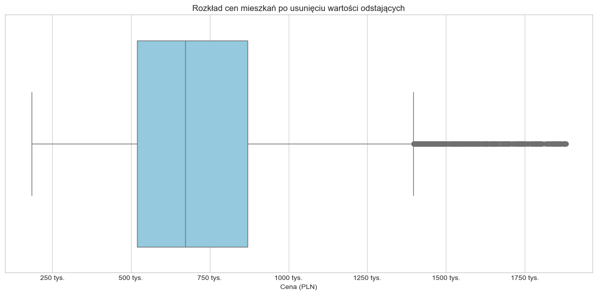
    


Ze względu na duże różnice cen mieszkań pomiędzy miastami (np. Warszawa vs. Rzeszów), zdecydowaliśmy się na bardziej precyzyjne podejście do filtrowania wartości odstających – zrobiliśmy to **osobno dla każdego miasta**.

Dla każdej lokalizacji odcięliśmy 1% najtańszych oraz 5% najdroższych mieszkań (czyli zastosowaliśmy 1. i 95. percentyl lokalnie). Taki zabieg pozwala zachować reprezentatywność danych, a jednocześnie usuwa ekstremalne przypadki, które mogłyby zaburzyć analizę.

Dzięki temu:

- Unikamy błędu polegającego na wspólnym usunięciu danych według jednego progu cenowego.
- Zachowujemy strukturę rynków lokalnych.
- Histogram rozkładu cen staje się bardziej symetryczny.

*Uwaga:* W wyniku tej operacji liczba obserwacji zmniejszyła się z ~92 967 do ~83 000. Pozostałe dane dobrze reprezentują lokalne rynki mieszkań – bez skrajnych przypadków ani luksusowych nieruchomości.

Po oczyszczeniu zbioru danych zaobserwowano zmianę rozkładu cen – zredukowano liczbę ekstremalnych wartości, dzięki czemu analiza staje się bardziej reprezentatywna, a histogram staje się wyraźnie mniej skośny, choć wciąż lekko prawostronny. Niestety, ale wykluczenie części obserwacji może prowadzić do utraty niektórych informacji, np. o nieruchomościach luksusowych. My jednak skupiamy się na segmencie mieszkań przeznaczonych dla zwykłego "Kowalskiego".

## WIZUALIZACJE


```python
# Wykres 1: Rozkład cen mieszkań w miastach
city_order = (
    df.groupby('city')['price']
      .median()
      .sort_values(ascending=False)
      .index
)

fig, ax = plt.subplots(figsize=(16, 8))

sns.boxplot(
    x='city',
    y='price',
    data=df,
    order=city_order,
    palette='Set3',
    flierprops=dict(marker='o', markersize=3, markerfacecolor='grey', alpha=0.4)
)

ax.set_title('Rozkład cen mieszkań w największych miastach Polski', fontsize=16)
ax.set_xlabel('Miasto')
ax.set_ylabel('Cena (PLN)')
ax.xaxis.set_tick_params(rotation=30)
ax.yaxis.set_major_formatter(ticker.FuncFormatter(lambda x, pos: f'{x/1000:.0f} tys.'))
ax.grid(True, axis='y', linestyle='--', alpha=0.5)

plt.tight_layout()
plt.show()
```

    C:\Users\olale\AppData\Local\Temp\ipykernel_12048\2364514622.py:11: FutureWarning: 
    
    Passing `palette` without assigning `hue` is deprecated and will be removed in v0.14.0. Assign the `x` variable to `hue` and set `legend=False` for the same effect.
    
      sns.boxplot(
    


    
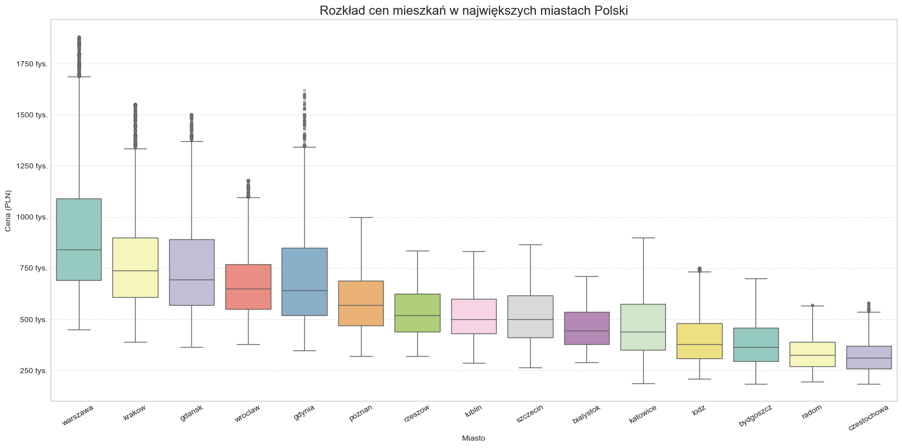
    


#### Rozkład cen mieszkań w największych miastach Polski

Boxplot jasno pokazuje duże zróżnicowanie mediany cen między miastami: Warszawa zdecydowanie prowadzi, Rzeszów, Lublin i Szczecin plasują się w środku stawki, natomiast najniższą medianę cen możemy dostrzec w Radomimu i Częstochowie. Rozstępy między kwartylami są szersze w metropoliach, co świadczy o bardziej zróżnicowanym segmencie rynkowym. Warto zauważyć, że nawet po odcięciu 5 % skrajnych cen, w Warszawie, Krakowie, Gdańsku i Gdyni widoczne są pojedyncze obserwacje powyżej 1,2 mln PLN, co odpowiada segmentowi premium.


```python
# Wykres 2: Zależność ceny od metrażu
# Sample do wykresu rozrzutu, cały zbiór do linii regresji i korelacji
scatter_sample = df.sample(6000, random_state=42)

# Współczynnik korelacji (Pearson)
corr = df['squareMeters'].corr(df['price'])
print(f"Pearson r = {corr:.3f}")

fig, ax = plt.subplots(figsize=(13, 8))

sns.scatterplot(
    x='squareMeters', y='price',
    data=scatter_sample,
    alpha=0.35, color='royalblue', ax=ax
)

# Linia trendu (regresja liniowa)
sns.regplot(
    x='squareMeters', y='price',
    data=df,
    scatter=False, ax=ax,
    color='darkorange', line_kws={'linestyle': '--'}
)

ax.set_title('Zależność ceny mieszkania od metrażu', fontsize=16)
ax.set_xlabel('Metraż (m²)')
ax.set_ylabel('Cena (PLN)')
ax.yaxis.set_major_formatter(ticker.FuncFormatter(lambda x, pos: f'{x/1000:.0f} tys.'))
ax.grid(True, linestyle='--', alpha=0.4)

# Ewentualnie skala log10 na osi Y
# ax.set_yscale('log')

# Podpis korelacji w prawym górnym rogu
ax.text(
    0.97, 0.95,
    f'Pearson r = {corr:.2f}',
    transform=ax.transAxes,
    ha='right', va='top',
    fontsize=11, bbox=dict(boxstyle='round,pad=0.3', fc='white', ec='gray', alpha=0.7)
)

plt.tight_layout()
plt.show()
```

    Pearson r = 0.563
    


    
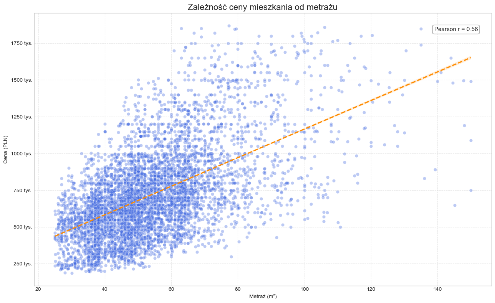
    


#### Zależność ceny od metrażu

Wykres punktowy (na losowej próbce 6 000 mieszkań) pokazuje wyraźną dodatnią korelację pomiędzy metrażem a ceną. Współczynnik **Pearsona r ≈ 0,5** wskazuje na silną zależność liniową – szczególnie przy większych metrażach widać rosnące zróżnicowanie cen.

**Warto odnotować:** Mieszkania ≈ 40–60 m² tworzą najbardziej gęsty „rdzeń” rynku, a powyżej 80 m² rozrzut cen znacząco rośnie, co może sugerować różne standardy wykończenia lub lokalizacje premium.

Linia trendu (pomarańczowa, regresja liniowa) dobrze oddaje medianę zależności, lecz nie oddaje rosnącej wariancji dla dużych metraży.


```python
# Wykres 3: Wpływ liczby pokoi na cenę
df['rooms'] = df['rooms'].astype(int)

# Posortowana lista liczby pokoi (1..6)
room_order = sorted(df['rooms'].unique())

fig, ax = plt.subplots(figsize=(12, 8))

sns.boxplot(
    x='rooms',
    y='price',
    data=df,
    order=room_order,          
    palette='viridis',           
    ax=ax
)

# Tytuły i opisy osi
ax.set_title('Wpływ liczby pokoi na cenę mieszkania', fontsize=16)
ax.set_xlabel('Liczba pokoi')
ax.set_ylabel('Cena (PLN)')
ax.yaxis.set_major_formatter(ticker.FuncFormatter(lambda x, pos: f'{x/1000:.0f} tys.'))
ax.grid(True, axis='y', linestyle='--', alpha=0.4)

# Dodanie etykiet mediany nad każdym boxem
for i, rooms in enumerate(room_order):
    median_price = df[df['rooms'] == rooms]['price'].median()
    ax.annotate(f'{median_price/1000:.0f}k', xy=(i, median_price),
                xytext=(0, 8), textcoords='offset points',
                ha='center', va='bottom', fontsize=10, color='black')

plt.tight_layout()
plt.show()
```

    C:\Users\olale\AppData\Local\Temp\ipykernel_12048\15196970.py:9: FutureWarning: 
    
    Passing `palette` without assigning `hue` is deprecated and will be removed in v0.14.0. Assign the `x` variable to `hue` and set `legend=False` for the same effect.
    
      sns.boxplot(
    


    
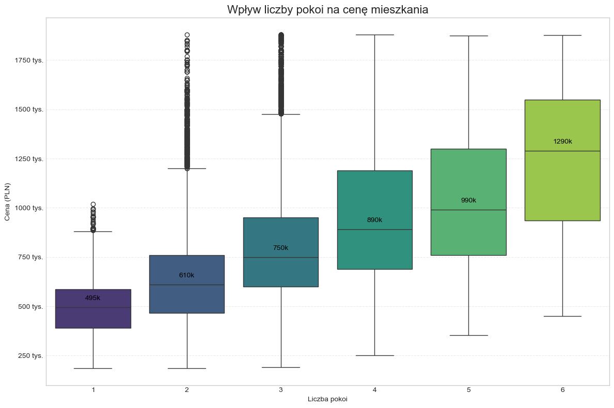
    


#### Wpływ liczby pokoi na cenę mieszkania

Liczba pokoi jest jednym z kluczowych czynników wpływających na cenę nieruchomości. Analiza boxplotów pokazuje wyraźny wzrost mediany cen wraz ze wzrostem liczby pokoi. Wśród mieszkań 2 i 3-pokojowych obserwujemy największą liczbę wartości odstających. Warto zauważyć, że rozpiętość cenowa rośnie wraz z liczbą pokoi. Zaskakujące jest, że najmniejsza różnica w medianie cem występuje między mieszkaniami 4-pokojowymi (890 tys.) a 5-pokojowymi (poniżej 990 tys.)


```python
# Wykres 4: Udział mieszkań z udogodnieniami

# Kolumny udogodnień
amenities = ['hasParkingSpace', 'hasBalcony', 'hasElevator',
             'hasSecurity', 'hasStorageRoom']

# Zamiana 'yes'/'no' → 1/0
amenity_counts = (
    df[amenities]
      .replace({'yes': 1, 'no': 0})
      .sum()
      .sort_values(ascending=False)
)

# Wykres
fig, ax = plt.subplots(figsize=(10, 6))
amenity_counts.plot(kind='barh', color='teal', ax=ax)

ax.set_title('Udział mieszkań z udogodnieniami', fontsize=16)
ax.set_xlabel('Liczba mieszkań')
ax.set_ylabel('Udogodnienie')
ax.invert_yaxis()

# Dodawanie etykiet procentowych
total_flats = len(df)
for i, (value, name) in enumerate(zip(amenity_counts.values, amenity_counts.index)):
    pct = value / total_flats * 100
    ax.text(value + total_flats * 0.002, i, f'{pct:.1f}%', va='center', fontsize=10)

plt.tight_layout()
plt.show()
```

    C:\Users\olale\AppData\Local\Temp\ipykernel_12048\422329188.py:10: FutureWarning: Downcasting behavior in `replace` is deprecated and will be removed in a future version. To retain the old behavior, explicitly call `result.infer_objects(copy=False)`. To opt-in to the future behavior, set `pd.set_option('future.no_silent_downcasting', True)`
      .replace({'yes': 1, 'no': 0})
    


    
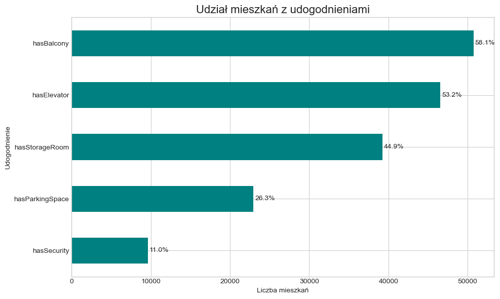
    


#### Udział mieszkań wyposażonych w wybrane udogodnienia

Najczęściej spotykanym udogodnieniem jest **balkon** – posiada go aż ~58% analizowanych mieszkań. Na kolejnych miejscach znajznajduje winda (ok. 53%) oraz komórka lokatorska (ok. 45%), co odzwierciedla przewagę bloków i apartamentowców w większych miastach. 

Z kolei **miejsce parkingowe** i **ochrona** występują rzadziej (ok. 26% i 10 %), gdyż są charakterystyczne głównie dla nowszych osiedli o podwyższonym standardzie.


```python
# Wykres 5: Wpływ odległości od centrum na cenę za metr kwadratowy
df = df[df['squareMeters'] > 0]                     
df['price_per_m2'] = df['price'] / df['squareMeters']

# Scatter z kolorem wg miasta
sample = df.sample(6000, random_state=42)

fig, ax = plt.subplots(figsize=(12, 8))

sns.scatterplot(
    data=sample,
    x='centreDistance',
    y='price_per_m2',
    hue='city',
    palette='tab10',
    alpha=0.3,
    ax=ax
)

# Linia LOWESS (lokalnie wygładzona regresja)
sns.regplot(
    data=df, x='centreDistance', y='price_per_m2',
    scatter=False, lowess=True,
    color='darkorange', line_kws={'linestyle': '--'}, ax=ax
)
# Formatowanie osi
ax.set_title('Wpływ odległości od centrum na cenę za metr kwadratowy', fontsize=16)
ax.set_xlabel('Odległość od centrum (km)')
ax.set_ylabel('Cena za m² (PLN)')
ax.yaxis.set_major_formatter(ticker.FuncFormatter(lambda x, pos: f'{x/1000:.0f} tys.'))

ax.grid(True, linestyle='--', alpha=0.4)
ax.legend(title='Miasto', bbox_to_anchor=(1.02, 1), loc='upper left')

# Współczynnik korelacji
pearson_r = df['centreDistance'].corr(df['price_per_m2'])
ax.text(0.97, 0.05, f'Pearson r = {pearson_r:.2f}',
        transform=ax.transAxes, ha='right', va='bottom',
        bbox=dict(boxstyle='round,pad=0.3', fc='white', ec='gray', alpha=0.6))

plt.tight_layout()
plt.show()
```


    
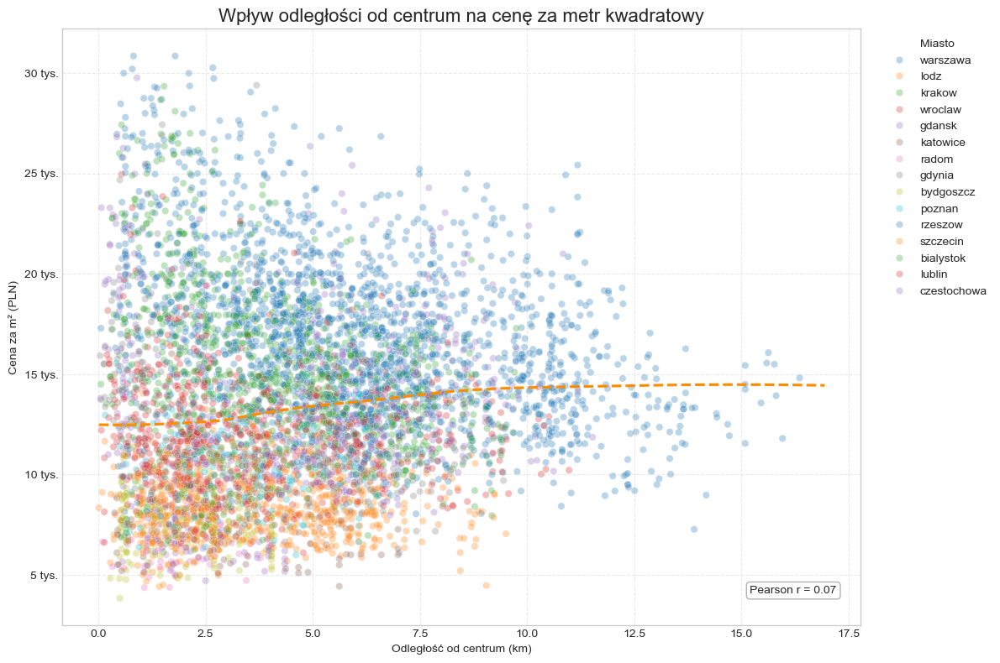
    


#### Wpływ odległości od centrum na cenę za metr kwadratowy

Wykres rozrzutu pokazuje relację między odległością od centrum miasta a ceną za metr kwadratowy mieszkania. Dane zostały dodatkowo pokolorowane według miasta. Współczynnik korelacji Pearsona wynosi r = 0.07, co oznacza bardzo słabą dodatnią korelację.

Jest to dosć zaskakujące i Wbrew intuicji, gdyż brakuje wyraźnej zależności między odległością a ceną za m² – możliwe, że wpływ lokalizacji ukryty pod innymi zmiennymi.

Widoczny silny rozrzut cen na każdym poziomie odległości – sugeruje, że sam dystans od centrum nie jest wystarczającym predyktorem ceny.

Wykres daje ciekawy wgląd w złożoność rynku mieszkaniowego i wskazuje na potrzebę uwzględnienia dodatkowych cech w analizie.

## ANALIZA OPISOWA


```python
# Analiza 1: Statystyki cen za metr kwadratowy według miast
city_stats = (
    df.groupby('city')['price_per_m2']
      .agg(mean='mean', median='median', std='std', count='count')
      .sort_values(by='median', ascending=False)
)

# Barplot mediany cena/m2
city_stats_reset = city_stats.reset_index()

fig, ax = plt.subplots(figsize=(14, 8))
sns.barplot(
    x='city', y='median',
    data=city_stats_reset,
    palette='light:#5A9_r',
    ax=ax
)

ax.set_title('Mediana cen za m² w największych miastach Polski', fontsize=16)
ax.set_xlabel('')
ax.set_ylabel('Mediana ceny za m² (PLN)')
ax.yaxis.set_major_formatter(ticker.FuncFormatter(lambda x, pos: f'{x/1000:.0f} tys.'))
ax.grid(True, axis='y', linestyle='--', alpha=0.4)

# Etykiety z wartością na końcach słupków
for p in ax.patches:
    value = p.get_height()
    ax.annotate(f'{value/1000:.1f}k',
                xy=(p.get_x() + p.get_width() / 2, value),
                xytext=(0, 5), textcoords='offset points',
                ha='center', va='bottom', fontsize=9, color='black')

plt.tight_layout()
plt.show()

# Wyświetlenie sformatowanej tabeli w notebooku
display(city_stats.style.format({'mean':'{:.0f}', 'median':'{:.0f}',
                                 'std':'{:.0f}', 'count':'{:,.0f}'}))

```

    C:\Users\olale\AppData\Local\Temp\ipykernel_12048\89608967.py:12: FutureWarning: 
    
    Passing `palette` without assigning `hue` is deprecated and will be removed in v0.14.0. Assign the `x` variable to `hue` and set `legend=False` for the same effect.
    
      sns.barplot(
    


    
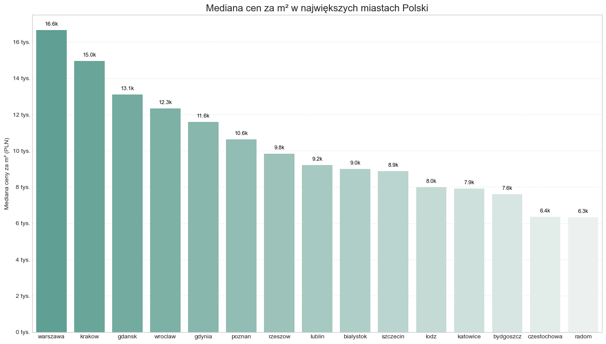
    


<style type="text/css">
</style>
<table id="T_d228b">
  <thead>
    <tr>
      <th class="blank level0" >&nbsp;</th>
      <th id="T_d228b_level0_col0" class="col_heading level0 col0" >mean</th>
      <th id="T_d228b_level0_col1" class="col_heading level0 col1" >median</th>
      <th id="T_d228b_level0_col2" class="col_heading level0 col2" >std</th>
      <th id="T_d228b_level0_col3" class="col_heading level0 col3" >count</th>
    </tr>
    <tr>
      <th class="index_name level0" >city</th>
      <th class="blank col0" >&nbsp;</th>
      <th class="blank col1" >&nbsp;</th>
      <th class="blank col2" >&nbsp;</th>
      <th class="blank col3" >&nbsp;</th>
    </tr>
  </thead>
  <tbody>
    <tr>
      <th id="T_d228b_level0_row0" class="row_heading level0 row0" >warszawa</th>
      <td id="T_d228b_row0_col0" class="data row0 col0" >17021</td>
      <td id="T_d228b_row0_col1" class="data row0 col1" >16650</td>
      <td id="T_d228b_row0_col2" class="data row0 col2" >3942</td>
      <td id="T_d228b_row0_col3" class="data row0 col3" >30,076</td>
    </tr>
    <tr>
      <th id="T_d228b_level0_row1" class="row_heading level0 row1" >krakow</th>
      <td id="T_d228b_row1_col0" class="data row1 col0" >15459</td>
      <td id="T_d228b_row1_col1" class="data row1 col1" >14953</td>
      <td id="T_d228b_row1_col2" class="data row1 col2" >3616</td>
      <td id="T_d228b_row1_col3" class="data row1 col3" >13,337</td>
    </tr>
    <tr>
      <th id="T_d228b_level0_row2" class="row_heading level0 row2" >gdansk</th>
      <td id="T_d228b_row2_col0" class="data row2 col0" >14049</td>
      <td id="T_d228b_row2_col1" class="data row2 col1" >13095</td>
      <td id="T_d228b_row2_col2" class="data row2 col2" >3810</td>
      <td id="T_d228b_row2_col3" class="data row2 col3" >7,749</td>
    </tr>
    <tr>
      <th id="T_d228b_level0_row3" class="row_heading level0 row3" >wroclaw</th>
      <td id="T_d228b_row3_col0" class="data row3 col0" >12710</td>
      <td id="T_d228b_row3_col1" class="data row3 col1" >12338</td>
      <td id="T_d228b_row3_col2" class="data row3 col2" >2637</td>
      <td id="T_d228b_row3_col3" class="data row3 col3" >9,030</td>
    </tr>
    <tr>
      <th id="T_d228b_level0_row4" class="row_heading level0 row4" >gdynia</th>
      <td id="T_d228b_row4_col0" class="data row4 col0" >12264</td>
      <td id="T_d228b_row4_col1" class="data row4 col1" >11578</td>
      <td id="T_d228b_row4_col2" class="data row4 col2" >3523</td>
      <td id="T_d228b_row4_col3" class="data row4 col3" >3,354</td>
    </tr>
    <tr>
      <th id="T_d228b_level0_row5" class="row_heading level0 row5" >poznan</th>
      <td id="T_d228b_row5_col0" class="data row5 col0" >10800</td>
      <td id="T_d228b_row5_col1" class="data row5 col1" >10622</td>
      <td id="T_d228b_row5_col2" class="data row5 col2" >2115</td>
      <td id="T_d228b_row5_col3" class="data row5 col3" >3,431</td>
    </tr>
    <tr>
      <th id="T_d228b_level0_row6" class="row_heading level0 row6" >rzeszow</th>
      <td id="T_d228b_row6_col0" class="data row6 col0" >9894</td>
      <td id="T_d228b_row6_col1" class="data row6 col1" >9846</td>
      <td id="T_d228b_row6_col2" class="data row6 col2" >1999</td>
      <td id="T_d228b_row6_col3" class="data row6 col3" >715</td>
    </tr>
    <tr>
      <th id="T_d228b_level0_row7" class="row_heading level0 row7" >lublin</th>
      <td id="T_d228b_row7_col0" class="data row7 col0" >9377</td>
      <td id="T_d228b_row7_col1" class="data row7 col1" >9222</td>
      <td id="T_d228b_row7_col2" class="data row7 col2" >1700</td>
      <td id="T_d228b_row7_col3" class="data row7 col3" >2,162</td>
    </tr>
    <tr>
      <th id="T_d228b_level0_row8" class="row_heading level0 row8" >bialystok</th>
      <td id="T_d228b_row8_col0" class="data row8 col0" >9178</td>
      <td id="T_d228b_row8_col1" class="data row8 col1" >9000</td>
      <td id="T_d228b_row8_col2" class="data row8 col2" >1877</td>
      <td id="T_d228b_row8_col3" class="data row8 col3" >955</td>
    </tr>
    <tr>
      <th id="T_d228b_level0_row9" class="row_heading level0 row9" >szczecin</th>
      <td id="T_d228b_row9_col0" class="data row9 col0" >9044</td>
      <td id="T_d228b_row9_col1" class="data row9 col1" >8869</td>
      <td id="T_d228b_row9_col2" class="data row9 col2" >2221</td>
      <td id="T_d228b_row9_col3" class="data row9 col3" >2,340</td>
    </tr>
    <tr>
      <th id="T_d228b_level0_row10" class="row_heading level0 row10" >lodz</th>
      <td id="T_d228b_row10_col0" class="data row10 col0" >8186</td>
      <td id="T_d228b_row10_col1" class="data row10 col1" >7982</td>
      <td id="T_d228b_row10_col2" class="data row10 col2" >1625</td>
      <td id="T_d228b_row10_col3" class="data row10 col3" >6,657</td>
    </tr>
    <tr>
      <th id="T_d228b_level0_row11" class="row_heading level0 row11" >katowice</th>
      <td id="T_d228b_row11_col0" class="data row11 col0" >8427</td>
      <td id="T_d228b_row11_col1" class="data row11 col1" >7916</td>
      <td id="T_d228b_row11_col2" class="data row11 col2" >2303</td>
      <td id="T_d228b_row11_col3" class="data row11 col3" >2,258</td>
    </tr>
    <tr>
      <th id="T_d228b_level0_row12" class="row_heading level0 row12" >bydgoszcz</th>
      <td id="T_d228b_row12_col0" class="data row12 col0" >7774</td>
      <td id="T_d228b_row12_col1" class="data row12 col1" >7595</td>
      <td id="T_d228b_row12_col2" class="data row12 col2" >1639</td>
      <td id="T_d228b_row12_col3" class="data row12 col3" >3,414</td>
    </tr>
    <tr>
      <th id="T_d228b_level0_row13" class="row_heading level0 row13" >czestochowa</th>
      <td id="T_d228b_row13_col0" class="data row13 col0" >6519</td>
      <td id="T_d228b_row13_col1" class="data row13 col1" >6351</td>
      <td id="T_d228b_row13_col2" class="data row13 col2" >1255</td>
      <td id="T_d228b_row13_col3" class="data row13 col3" >1,171</td>
    </tr>
    <tr>
      <th id="T_d228b_level0_row14" class="row_heading level0 row14" >radom</th>
      <td id="T_d228b_row14_col0" class="data row14 col0" >6536</td>
      <td id="T_d228b_row14_col1" class="data row14 col1" >6336</td>
      <td id="T_d228b_row14_col2" class="data row14 col2" >1134</td>
      <td id="T_d228b_row14_col3" class="data row14 col3" >794</td>
    </tr>
  </tbody>
</table>


#### Statystyki cen za metr kwadratowy według miast

Powyższy wykres prezentuje medianę cen za m² w 15 największych polskich miastach, opartą na danych z blisko 83 tys. ofert. Najdroższym rynkiem pozostaje **Warszawa**, gdzie mediana osiąga **16,5 tys. PLN/m²**, a średnia nawet **16,9 tys.** Drugi najdroższy rynek to **Kraków** (mediana: 14,9 tys.), a podium zamyka **Gdańsk** (13,0 tys.). Warto zauważyć, że **różnica między średnią a medianą** wskazuje na obecność drogich ofert (np. premium lub z rynku pierwotnego).

Z kolei najtańsze miasta to **Radom** i **Częstochowa**, gdzie mediana oscyluje wokół **6,3 tys. PLN/m²** – mniej niż **40 % ceny warszawskiej**. 

Wybrane statystyki:

| Miasto       | Średnia (PLN/m²) | Mediana (PLN/m²) | Odch. stand. | Liczba ofert |
|--------------|------------------|------------------|--------------|--------------|
| Warszawa     | 16 900           | 16 522           | 3 877        | 28 278       |
| Kraków       | 15 338           | 14 878           | 3 508        | 12 542       |
| Gdańsk       | 13 828           | 12 972           | 3 608        | 7 285        |
| Wrocław      | 12 640           | 12 284           | 2 581        | 8 502        |
| Gdynia       | 11 981           | 11 448           | 3 110        | 3 158        |
| Poznań       | 10 749           | 10 592           | 2 069        | 3 246        |
| Rzeszów      | 9 788            | 9 694            | 1 971        | 673          |
| Lublin       | 9 349            | 9 205            | 1 681        | 2 037        |
| Białystok    | 9 094            | 8 925            | 1 847        | 900          |
| Szczecin     | 9 032            | 8 828            | 2 212        | 2 209        |
| Łódź         | 8 140            | 7 962            | 1 600        | 6 272        |
| Katowice     | 8 392            | 7 900            | 2 259        | 2 127        |
| Bydgoszcz    | 7 719            | 7 572            | 1 601        | 3 231        |
| Radom        | 6 454            | 6 292            | 1 061        | 752          |
| Częstochowa  | 6 438            | 6 285            | 1 200        | 1 103        |

**Odchylenie standardowe** jest szczególnie wysokie w dużych aglomeracjach (Warszawa, Kraków, Gdańsk), co wskazuje na duży rozrzut cen.

**Wnioski:**
- Rynek mieszkaniowy w Polsce jest silnie spolaryzowany – różnice między najdroższymi a najtańszymi miastami sięgają ponad **10 tys. PLN/m²**.
- Zróżnicowanie cen sugeruje, że średnie wartości nie zawsze oddają faktyczny rozkład – **mediana jest bardziej reprezentatywna** w wielu przypadkach.
- Najwięcej analizowanych ofert pochodziło z Warszawy (ponad 28 tys.), co zwiększa wiarygodność estymacji dla tego miasta.
- Warto zauważyć niewilką liczbę ofert dla Rzeszowa, Białegostoku i Radomia, w związku z czym do wyników analizy należy podchodzić z lekką rezerwą.


```python
# Analiza 2: Macierz korelacji zmiennych numerycznych
# Macierz korelacji
corr_columns = df.select_dtypes(include=['number']).columns
num_df = df[corr_columns].copy()

# Obliczanie macierzy korelacji
# Można użyć różnych metod: 'pearson', 'spearman', 'kendall
corr = num_df.corr(method='pearson')

# Tworzenie maski dla górnego trójkąta aby uniknąć duplikacji wartości
# mask = np.triu(np.ones_like(corr, dtype=bool))

# Heatmapa
plt.figure(figsize=(13, 10))
sns.heatmap(
    corr,
    #mask=mask,
    cmap='coolwarm',
    vmin=-1, vmax=1,
    annot=True, fmt=".2f",
    linewidths=0.5,
    square=True,
    cbar_kws={"shrink": .8}
)
plt.title('Macierz korelacji (Pearson)', fontsize=16, pad=12)
plt.xticks(rotation=60, ha='right')
plt.tight_layout()
plt.show()

```


    
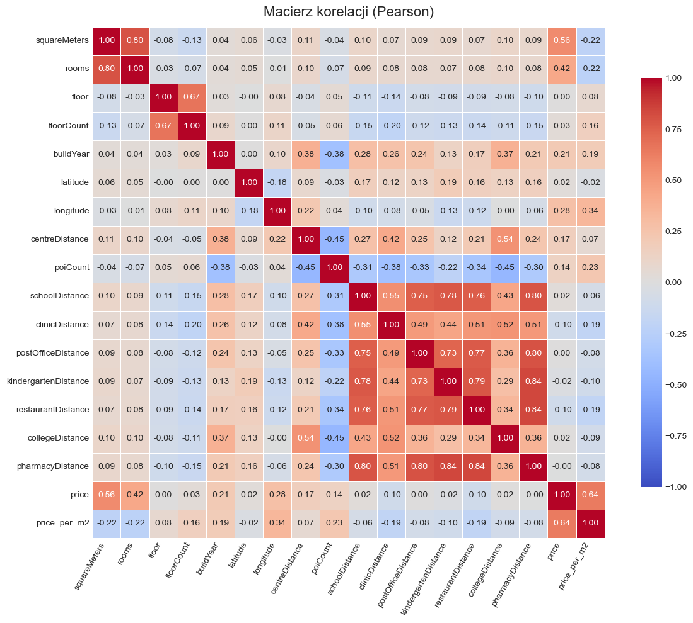
    


#### Macierz korelacji zmiennych numerycznych

Najsilniejsze dodatnie zależności:

- **Metraż (`squareMeters`) vs. cena (`price`)**: *r* = 0,56  
  Im większa powierzchnia, tym wyższa cena całkowita — ten efekt był już widoczny na wykresie rozrzutu.
- **Liczba pokoi (`rooms`) vs. metraż**: *r* = 0,8  
  Więcej pokoi zwykle oznacza większą powierzchnię.

Najsilniejsze ujemne zależności:

- **Rok budowy (`buildYear`) vs. odległość od centrum** (`centreDistance`): *r* ≈ -0,32  
  Nowsze inwestycje częściej pojawiają się poza ścisłym centrum.
- **Odległość od centrum (`centreDistance`) vs. liczba POI** (`poiCount`): *r* ≈ -0,45


```python
# Analiza 2: Wpływ udogodnień na cenę mieszkań
amenity_map = {
    'hasParkingSpace': 'Miejsce parkingowe',
    'hasBalcony'     : 'Balkon',
    'hasElevator'    : 'Winda',
    'hasSecurity'    : 'Ochrona',
    'hasStorageRoom' : 'Komórka lokatorska'
}

fig, axes = plt.subplots(3, 2, figsize=(16, 16))
axes = axes.flatten()
fmt = ticker.FuncFormatter(lambda x, pos: f'{x/1000:.0f} tys.')

# Wspólny zakres dla osi Y
y_min, y_max = 4e5, 1.2e6   # 400 k – 1 200 k

for ax, (col, title) in zip(axes, amenity_map.items()):
    sns.boxplot(
        data=df,
        x=col,
        y='price',
        hue=col,
        legend=False,
        order=['no', 'yes'],
        palette='pastel',
        ax=ax
    )
    ax.set_title(f'Wpływ {title.lower()} na cenę')
    ax.set_xlabel(f'Posiada {title.lower()}')
    ax.set_ylabel('Cena (PLN)' if col in ['hasParkingSpace', 'hasElevator', 'hasStorage'] else '')
    ax.set_ylim(y_min, y_max)
    ax.yaxis.set_major_formatter(fmt)
    ax.grid(True, axis='y', linestyle='--', alpha=0.4)

    # Mediana jako tekst na wykresie
    med = df.groupby(col)['price'].median()
    for i, cat in enumerate(['no', 'yes']):
        if cat in med:
            ax.annotate(f'{med[cat]/1000:.0f}k',
                        xy=(i, med[cat]),
                        xytext=(0, 6), textcoords='offset points',
                        ha='center', va='bottom', fontsize=9)

# Ukrycie ostatniego wykresu, jeśli jest nieparzysta liczba udogodnień
if len(amenity_map) % 2 != 0:
    axes[-1].axis('off')

plt.tight_layout()
plt.show()

```


    
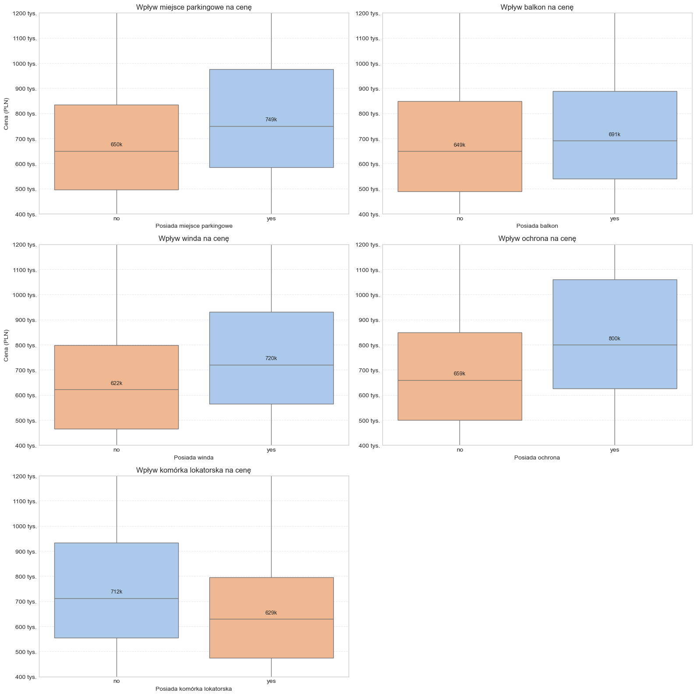
    


#### Wpływ udogodnień na cenę mieszkania

Powyższe boxploty porównują ceny mieszkań w zależności od posiadania wybranych udogodnień (miejsca parkingowego, balkonu, windy, komórki lokatorskiej i ochrony).

| Udogodnienie | Mediana z udog. | Mediana bez udog. | Różnica |
|--------------|-----------------|-------------------|---------|
| Miejsce parkingowe| **~749 tys. PLN** | ~650 tys. PLN | +15 % |
| Balkon            | **~691 tys. PLN** | ~649 tys. PLN | +6 %  |
| Winda             | **~720 tys. PLN** | ~622 tys. PLN | +16 % |
| Ochrona           | **~800 tys. PLN** | ~659 tys. PLN | +21 % |
| Komórka lokatorska| **~712 tys. PLN** | ~629 tys. PLN | +13 % |

Wszystkie analizowane udogodnienia mają pozytywny wpływ na cenę mieszkań. Największą różnicę cenową obserwujemy dla mieszkań z ochroną, windą i miejscem parkingowym, co sugeruje, że te cechy są szczególnie wartościowe dla kupujących. Najmniejszy wpływ na cenę ma balkon.

**Wniosek:** obecność udogodnień koreluje z wyższą ceną ofertową, ale skala wpływu różni się w zależności od rodzaju udogodnienia; czynniki te warto włączyć do modelu predykcyjnego.


# WNIOSKI

Podsumowując, analiza danych dotyczących cen mieszkań w 15 największych miastach Polski wykazała silne zróżnicowanie cen – zarówno ogólnych, jak i za metr kwadratowy – ze szczególnie wysokimi wartościami w Warszawie, Krakowie i Gdańsku. Do najważniejszych czynników wpływających na cenę należą: powierzchnia mieszkania (najmocniejszy predyktor), liczba pokoi, obecność udogodnień takich jak winda, miejsce parkingowe czy ochrona. Analiza korelacji ujawniła, że odległość od centrum ma mniejszy wpływ niż oczekiwano.

Ograniczeniem badania są dane pochodzące wyłącznie z ogłoszeń (a nie transakcyjne) i autocenzura cen przez sprzedających. W dalszej pracy dane te można wykorzystać do budowy predykcyjnego modelu cen mieszkań na wybranych rynkach lokalnych, uzupełnić o dodatkowe źródła danych lub przeprowadzić analizy segmentacji rynków.
